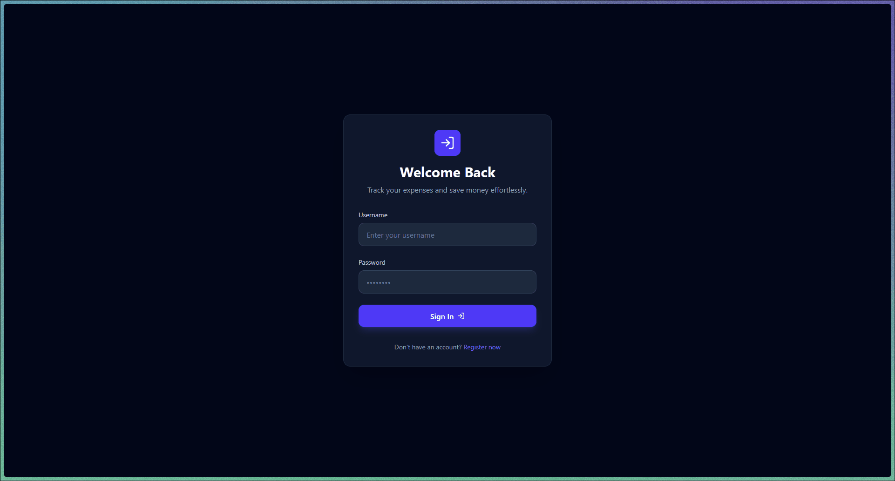

# Retro-Expense Tracker: Full-Stack Management System

A professional financial management application built with an AI-driven development workflow. This project integrates a robust Java 25 backend with a modern React 19 Single Page Application (SPA), focusing on security, type-safety, and automated documentation.

<p align="center">
  
  <br>
  <em>Quick walkthrough of the authentication and expense management flow.</em>
</p>

---

## Overview

This application provides a comprehensive solution for expense tracking, featuring secure user authentication and real-time data management. The architecture is built upon a strict REST API contract, ensuring seamless communication between the Spring Boot core and the TypeScript interface.

### Tech Stack

**Backend (The Engine):**
* **Java 25** & **Spring Boot 4.0.3**
* **Spring Security & JJWT (0.13.0):** Stateless authentication using JSON Web Tokens.
* **Spring Data JPA:** Persistence layer with relational mapping.
* **H2 Database:** In-memory database for high-speed development and testing.
* **SpringDoc OpenAPI (v3.0.2):** Automated REST API documentation (Swagger UI).
* **Validation:** Robust server-side data validation.

**Frontend (The Interface):**
* **React 19** + **Vite 7**: Ultra-fast development using the latest React features.
* **TypeScript 5.9**: Full type-safety across the component tree.
* **Tailwind CSS 4.0**: Utility-first styling using the latest engine (v4).
* **TanStack Query v5**: Advanced server-state management, caching, and synchronization.
* **React Router 7**: Sophisticated client-side routing and navigation.
* **React Hook Form + Zod**: High-performance form management with schema-based validation.
* **Axios**: Promised-based HTTP client with automated JWT injection.

---

## Architecture & Workflow

This project follows the **Industry Standard 2026** workflow:
1. **API-First Strategy:** The backend exposes a clear API contract via OpenAPI, facilitating frontend logic generation.
2. **AI-Assisted Delivery:** UI scaffolding via **Stitch** and intelligent endpoint mapping using **Antigravity AI**.
3. **Type-Safe Validation:** Synchronized validation logic using Hibernate Validator (Backend) and Zod (Frontend).


---

## Key Features

* **JWT-Secured Routes:** Protected frontend navigation integrated with Spring Security filters.
* **Interactive API Docs:** Integrated Swagger UI for real-time endpoint testing.
* **Modern UI/UX:** Responsive Dark Mode interface built with Lucide React icons.
* **Performance Optimized:** Smart data fetching and invalidation using React Query.

---

## Quick Start

### Prerequisites
* **JDK 25+**
* **Node.js 20+**
* **Maven 3.9+**

### Installation & Execution
1. **Clone the repository:**
   ```bash
   git clone [https://github.com/JesusNF99/MyExpenseTracker-Fullstack.git](https://github.com/JesusNF99/MyExpenseTracker-Fullstack.git)
   ```
2. Build the entire project (Backend + Frontend):
   ```bash
   mvn clean install
   ```
3. Run the Backend:
   ```bash
   cd backend && mvn spring-boot:run
   ```
4. Run the Frontend:
   ```bash
   cd frontend && npm install && npm run dev
   ```
